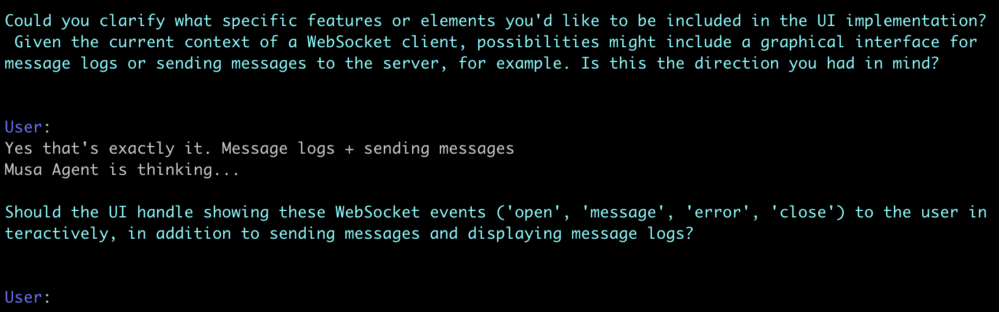

<!--
*** Thanks for checking out the Best-README-Template. If you have a suggestion
*** that would make this better, please fork the repo and create a pull request
*** or simply open an issue with the tag "enhancement".
*** Don't forget to give the project a star! ⭐
*** Thanks again! Now go create something AMAZING! 😃
-->
<!-- PROJECT SHIELDS -->
<!--
*** I'm using markdown "reference style" links for readability.
*** Reference links are enclosed in brackets [ ] instead of parentheses ( ).
*** See the bottom of this document for the declaration of the reference variables
*** for contributors-url, forks-url, etc. This is an optional, concise syntax you may use.
*** https://www.markdownguide.org/basic-syntax/#reference-style-links
-->
<!-- [![Issues][issues-shield]][issues-url] -->
<!-- PROJECT LOGO -->
 

  
<!-- <h3 align="center">🤖 Musa AI 🤖</h3> -->
  

    Interactive AI coding agents that actually get your work done. 
     
    <!-- <a href="https://github.com/github_username/repo_name">View Demo</a>
    · -->
    <a href="https://askmusa.co/">Website</a>
    ·
    <a href="https://askmusa.co/request-beta/">Launch List</a>
    ·
    <a href="https://github.com/musa-dev-team/Musa-AI/issues">Report Bug</a>
    ·
    <a href="https://github.com/musa-dev-team/Musa-AI/issues">Request Feature</a>
  

<!-- TABLE OF CONTENTS -->

  
📑 Table of Contents

  <ol>
    <li>
      <a href="#about-the-project">About The Project</a>
      <!-- <ul>
        <li><a href="#built-with">Built With</a></li>
      </ul> -->
    </li>
    <li>
      <a href="#getting-started">Getting Started</a>
      <ul>
        <li><a href="#prerequisites">Prerequisites</a></li>
        <li><a href="#installation">Installation</a></li>
      </ul>
    </li>
    <li><a href="#usage">Usage</a></li>
    <li><a href="#roadmap">Roadmap</a></li>
    <li><a href="#contributing">Contributing</a></li>
    <li><a href="#license">License</a></li>
    <li><a href="#contact">Contact</a></li>
    <li><a href="#acknowledgments">Acknowledgments</a></li>
  </ol>

<!-- ABOUT THE PROJECT -->
  

# ℹ️ About The Project 

Musa AI offers you an interactive AI coding agent that works with you to get development tasks done. Whereas it is easy for autonomous coding agents to hallucinate and return incorrect results, Musa incorporates you, our users, into the workflow, ensuring more reliable results.

Interact with the agent at every step of the process, including discussing the development objective, designing the implementation plan, and even executing the tasks. 🙌✨
  

<!-- GETTING STARTED -->
# 🚀 Getting Started 
Running a Musa Agent is a very simple task. Just add our GitHub Application to your repo, clone this repository, and run the client-side agent. It's that easy! 🤩

## Installing the GitHub App
To install the GitHub App, follow these steps.
1. Navigate to our GitHub App page at: https://github.com/apps/musa-ai-helper
2. At the top right, click `Install` 🛠️
3. Select where you want to install Musa AI Helper
4. Select your repos and click `Install & Request`
5. Take note of the installation ID - at the end of the page's URL "installations/<installation_id>"

## Setting Up the Client Helper
To run Musa AI from your console, you need to set up the client-side helper application.
To do so, do the following:

1. Navigate to our GitHub Repo at: https://github.com/musa-dev-team/Musa-AI
2. Clone the repo locally
3. Copy and paste `.env.sample` and rename the copy to `.env`
4. Complete the `.env`
5. Run `npm install`

Now you're ready to start your Musa Agent! 🎉

Note: To find your installation id, navigate to https://github.com/apps/musa-ai-helper, click configure, click your team, and fit the installation id at the end of the page's URL: github.com/apps/musa-ai-helper/installations/<installation_id>
  

<!-- USAGE EXAMPLES -->
# 💡 Running your Musa Agent 
To start your Musa Agent, simply run `./musa.sh`. You will then be prompted to input some setup information about your objective, such as a name, a description, and some collaboration choices. See below to learn about the collaboration types. 🏗️👩‍💻

The Musa Agent's development process is broken down into 3 parts.

## 🎯 Objective Clarification 
After you have input your setup details and started the process, you can enter Objective Clarification. Here, you and Musa will work together to better define the scope of your development request. Musa will ask you questions, and all you need to do is respond. To ask a question back, type `-q <question>`.

At any point, type `-objective` to see your current objective.

When you are happy, run `-done` to move on.

## 🤝 Collaborative Planning 
Collaborative Planning lets you work with Musa to agree on an implementation strategy for your development task. Provide feedback to Musa's proposed solution until you are satisfied. At any point in time, you can run `-details` to see the details of the plan.

When you are happy, run `-confirm` to move on.

## 📋 Collaborative Task Execution 
In Collaborative Task Execution, you are able to walk step-by-step through the implementation with Musa to ensure that it is running according to your specifications. Run `-task` to see the current task, and change the task implementation by telling Musa what you want changed. Changes made will be refactored across the entire task process.

When you are ready to execute a task, type `-run`.

## ✅ Once Complete 
Once complete, you will be able to find your Musa-created PR in your GitHub Repo. How exciting! 🎉

## 📝 Usage and Limitations 
Musa is still in its early stages, so there are a few
  

# ❤️ From Musa 
We are excited to have you try our product! Please leave us feedback at the email bellow, and if you would like to submit a bug or a feature request, you can do so [here](https://github.com/musa-dev-team/Musa-AI/issues).

To keep informed of our excited upcoming launches, sign up to our [launch list](https://askmusa.co/request-beta/)!

And finally, if you enjoy using Musa AI, star our repo. It really helps us out! 🌟